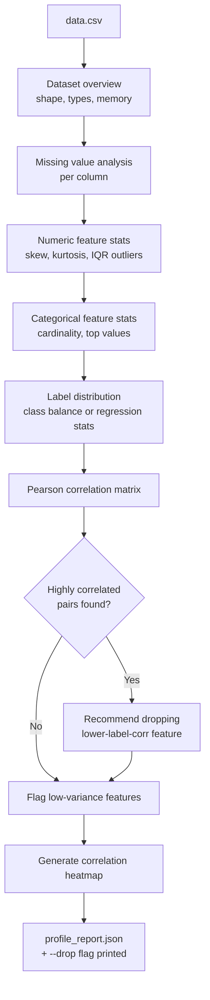
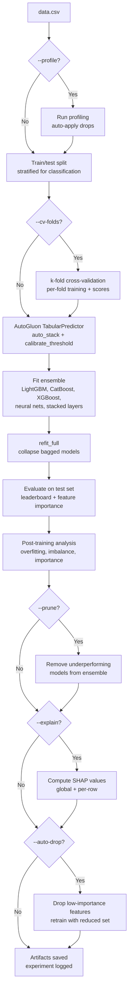
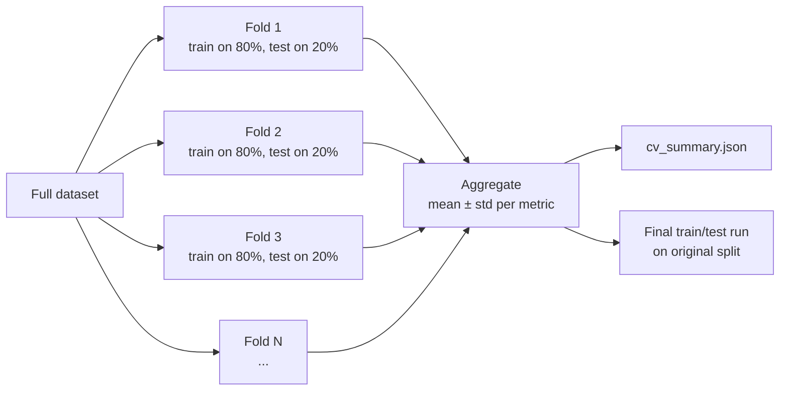
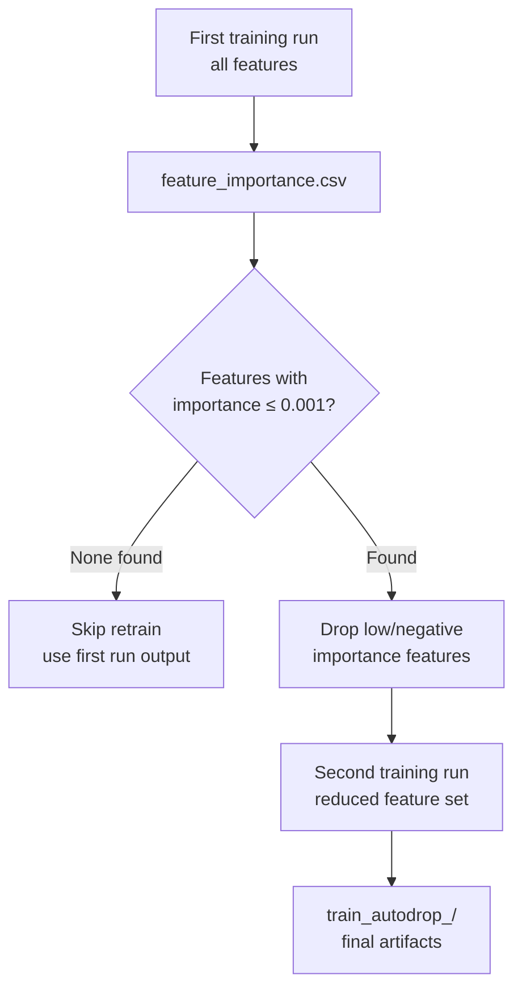
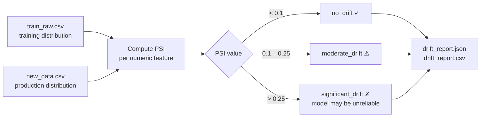
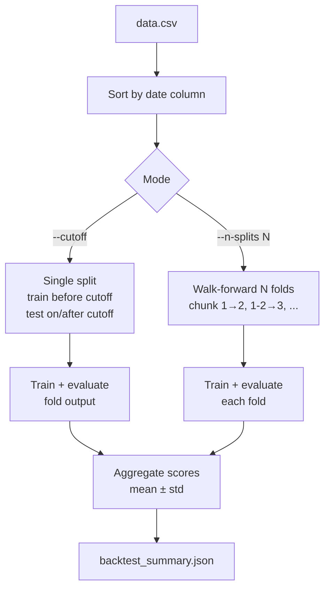
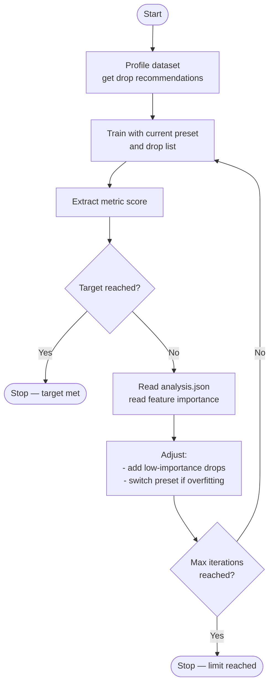
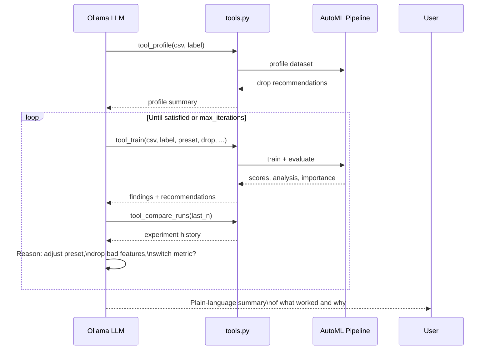

# Training Options

## Table of Contents

- [Project Structure](#project-structure)
- [Entry Points](#entry-points)
- [Dataset Profiling](#dataset-profiling)
  - [Options](#options)
  - [How It Works](#how-it-works)
- [Training](#training)
  - [Options](#options-1)
  - [--seed: Reproducibility Verification](#--seed-reproducibility-verification)
  - [--profile: Integrated Profiling](#--profile-integrated-profiling)
  - [--cv-folds: Cross-Validation](#--cv-folds-cross-validation)
  - [--prune: Ensemble Pruning](#--prune-ensemble-pruning)
  - [--explain: SHAP Explainability](#--explain-shap-explainability)
  - [--calibrate-threshold: Decision Threshold Calibration](#--calibrate-threshold-decision-threshold-calibration)
  - [--auto-drop: Automatic Feature Pruning](#--auto-drop-automatic-feature-pruning)
- [Prediction](#prediction)
  - [Options](#options-2)
  - [--min-confidence: Confidence Filtering](#--min-confidence-confidence-filtering)
  - [--drift-check: Data Drift Detection](#--drift-check-data-drift-detection)
  - [--decision-threshold: Override Binary Decision Threshold](#--decision-threshold-override-binary-decision-threshold)
- [Backtesting](#backtesting)
  - [Options](#options-3)
- [Model Comparison](#model-comparison)
  - [Options](#options-4)
- [Experiment Tracking](#experiment-tracking)
  - [Options](#options-5)
- [Autonomous Training Agent](#autonomous-training-agent)
  - [Options](#options-6)
- [Ollama Agent (LLM-Driven)](#ollama-agent-llm-driven)
  - [Setup](#setup)
  - [Options](#options-7)
  - [How It Works](#how-it-works-1)
  - [Supported Models](#supported-models)
  - [Error Handling](#error-handling)
- [LLM Tools Reference](#llm-tools-reference)
  - [Pre-training tools](#pre-training-tools)
  - [Training tools](#training-tools)
  - [Post-training diagnostic tools](#post-training-diagnostic-tools)
  - [Cost notes](#cost-notes)
  - [Framework integration](#framework-integration)
- [Output Artifacts](#output-artifacts)
  - [Training Outputs](#training-outputs)
  - [Prediction Outputs](#prediction-outputs)

This project uses [uv](https://docs.astral.sh/uv/) for dependency management and script execution. All CLI commands are defined as `[project.scripts]` in `pyproject.toml` and should be invoked via `uv run`:

```bash
uv run <command> [ARGS]
```

`uv run` resolves the project's virtual environment and dependencies automatically — no manual `pip install` or `source .venv/bin/activate` needed.

## Project Structure

```
src/automl_model_training/
├── config.py                          # Shared defaults, thresholds, logging
├── data.py                            # CSV loading, train/test split, normalization
├── train.py                           # Model training, cross-validation, CLI
├── predict.py                         # Inference, confidence filtering, drift check
├── backtest.py                        # Temporal walk-forward backtesting
├── drift.py                           # PSI-based data drift detection
├── profile.py                         # Dataset profiling and correlation analysis
├── compare.py                         # Side-by-side model run comparison
├── experiment.py                      # Local experiment tracking and comparison
├── agent.py                           # Autonomous iterative training agent
└── evaluate/
    ├── analyze.py                     # Post-training analysis & recommendations
    ├── classification.py              # Train-time binary/multiclass artifacts
    ├── regression.py                  # Train-time regression artifacts
    ├── predict_classification.py      # Predict-time classification artifacts
    ├── predict_regression.py          # Predict-time regression artifacts
    ├── prune.py                       # Ensemble pruning analysis and model deletion
    └── explain.py                     # SHAP-based model explainability
```

## Entry Points

| Command                     | Purpose                                            |
| --------------------------- | -------------------------------------------------- |
| `uv run train`              | Train with auto-detected problem type              |
| `uv run train-binary`       | Train binary classification (defaults to F1)       |
| `uv run train-regression`   | Train regression (defaults to RMSE)                |
| `uv run predict`            | Run inference with a trained model                 |
| `uv run predict-binary`     | Predict alias for binary models                    |
| `uv run predict-regression` | Predict alias for regression models                |
| `uv run backtest`           | Temporal walk-forward backtesting                  |
| `uv run profile`            | Dataset profiling and correlation analysis         |
| `uv run compare`            | Compare two or more training runs side by side     |
| `uv run experiments`        | Compare experiments from the JSONL log             |
| `uv run agent-binary`       | Autonomous binary training agent (F1 target)       |
| `uv run agent-regression`   | Autonomous regression training agent (RMSE target) |
| `uv run agent-ollama`       | LLM-driven agent via Ollama (any problem type)     |

---

## Dataset Profiling

**Why it exists:** Raw datasets often contain redundant, correlated, or low-quality features that hurt model accuracy and slow training. Profiling before training identifies these issues so you can make informed decisions about what to keep.

```bash
uv run profile data.csv [OPTIONS]
```

### Options

| Flag           | Default  | Description                              |
| -------------- | -------- | ---------------------------------------- |
| `--label`      | `target` | Name of the target column                |
| `--threshold`  | `0.90`   | Correlation threshold for flagging pairs |
| `--output-dir` | `output` | Directory for profile outputs            |

### How It Works

1. Computes dataset overview (shape, types, memory, duplicates)
2. Analyzes missing values per column
3. Profiles numeric features: descriptive stats, skew, kurtosis, outlier detection (IQR)
4. Profiles categorical features: cardinality, top values, missing rates
5. Analyzes label distribution (class balance or regression stats)
6. Computes Pearson correlation matrix and flags highly correlated pairs
7. For each correlated pair, recommends dropping the feature less correlated with the label
8. Flags low-variance features
9. Generates a correlation heatmap

The CLI prints a ready-to-use `--drop` flag you can paste into your train command.



---

## Training

**Why it exists:** The core of the pipeline. AutoGluon trains an ensemble of models (LightGBM, CatBoost, XGBoost, neural nets, stacked layers) and selects the best combination automatically. The training module wraps this with data preparation, evaluation, analysis, and artifact generation.

```bash
uv run train data.csv [OPTIONS]
uv run train-binary data.csv [OPTIONS]      # locks to binary, defaults to F1
uv run train-regression data.csv [OPTIONS]  # locks to regression, defaults to RMSE
```



### Options

| Flag                    | Default  | Description                                                                   |
| ----------------------- | -------- | ----------------------------------------------------------------------------- |
| `--label`               | `target` | Target column name                                                            |
| `--problem-type`        | auto     | Force: `binary`, `multiclass`, `regression`, `quantile` (train only)          |
| `--eval-metric`         | auto     | Evaluation metric (e.g. `f1`, `roc_auc`, `rmse`)                              |
| `--preset`              | `best`   | AutoGluon preset: `extreme`, `best`, `best_v150`, `high`, `good`              |
| `--time-limit`          | no limit | Max training time in seconds                                                  |
| `--test-size`           | `0.2`    | Fraction of data held out for testing                                         |
| `--seed`                | `42`     | Random seed for reproducible train/test splits                                |
| `--output-dir`          | `output` | Base directory for run outputs                                                |
| `--drop`                | none     | Feature columns to exclude                                                    |
| `--cv-folds`            | none     | Run k-fold cross-validation before the final train/test run                   |
| `--prune`               | off      | Remove underperforming models from the ensemble                               |
| `--explain`             | off      | Compute SHAP values for model explainability                                  |
| `--profile`             | off      | Profile dataset and auto-apply drop recommendations before training           |
| `--calibrate-threshold` | none     | Calibrate binary decision threshold for a specific metric (e.g. `f1`)         |
| `--auto-drop`           | off      | Train once, drop features with near-zero or negative importance, then retrain |

### --seed: Reproducibility Verification

**Why it exists:** Every random operation (train/test split, SHAP sampling) uses a shared seed so results are reproducible. The `--seed` flag lets you verify reproducibility by running the same experiment with different seeds, or lock a specific seed for a production run.

```bash
uv run train data.csv --seed 123
```

### --profile: Integrated Profiling

**Why it exists:** Running `profile` and `train` as separate steps requires manually copying drop recommendations. The `--profile` flag runs profiling first, saves the report to a `profile/` subdirectory, and automatically applies the drop recommendations — one command instead of two.

```bash
uv run train data.csv --profile --label price
```

### --cv-folds: Cross-Validation

**Why it exists:** A single train/test split can give unreliable estimates, especially on small datasets. Cross-validation trains on multiple folds and reports mean ± std scores, giving a more stable picture of model performance before committing to the final train/test run.

```bash
# 5-fold CV then final train/test
uv run train data.csv --cv-folds 5
```

Uses stratified folds for classification (preserves class balance) and shuffled KFold for regression. Saves `cv_summary.json` with per-fold scores and aggregate statistics, plus individual `cv_fold_N/` directories.



### --prune: Ensemble Pruning

**Why it exists:** AutoGluon may produce dozens of models. Not all contribute to the final ensemble — some are redundant or underperforming. Pruning removes models that score >5% worse than the best and aren't in its dependency chain, reducing disk footprint and inference latency.

```bash
uv run train data.csv --prune
```

### --explain: SHAP Explainability

**Why it exists:** Permutation importance (always generated) shows which features matter, but not in which direction or by how much per prediction. SHAP values decompose each prediction into per-feature contributions, enabling both global and per-row explanations.

```bash
uv run train data.csv --explain
```

Uses KernelExplainer with up to 500 test samples. For wide datasets (100+ features), profile and drop low-value features first to keep SHAP runtime reasonable.

### --calibrate-threshold: Decision Threshold Calibration

**Why it exists:** For binary classification, the default 0.5 probability cutoff is rarely optimal for metrics like F1, balanced accuracy, or MCC. Calibrating the threshold post-training finds the cutoff that maximizes a specific metric on the validation set.

```bash
uv run train-binary data.csv --label is_fraud --calibrate-threshold f1
```

The calibrated threshold is saved to `model_info.json` and becomes the default for subsequent `predict` calls using that model. You can still override it at prediction time with `--decision-threshold`.

### --auto-drop: Automatic Feature Pruning

**Why it exists:** After training, permutation importance reveals which features have near-zero or negative impact on accuracy. Negative-importance features actively hurt predictions. This flag automates the train → inspect → drop → retrain cycle in a single command.

```bash
uv run train data.csv --auto-drop
```

The first pass trains normally and computes feature importance. Features with importance ≤ 0.001 (including negative values) are dropped, and a second training pass runs with the reduced feature set. The final output directory is prefixed `train_autodrop_`. If no low-importance features are found, the retrain is skipped.



---

## Prediction

**Why it exists:** After training, you need to run the model on new data. The prediction module loads a trained model, runs inference, and produces problem-type-specific artifacts (probabilities for classification, residuals for regression).

```bash
uv run predict data.csv --model-dir output/train_<timestamp>/AutogluonModels [OPTIONS]
```

### Options

| Flag                   | Default              | Description                                                  |
| ---------------------- | -------------------- | ------------------------------------------------------------ |
| `--model-dir`          | (required)           | Path to the trained `AutogluonModels/` directory             |
| `--output-dir`         | `predictions_output` | Base directory for prediction outputs                        |
| `--min-confidence`     | none                 | Flag classification rows below this confidence (e.g. 0.7)    |
| `--drift-check`        | none                 | Path to training run directory for drift detection           |
| `--decision-threshold` | none                 | Override binary classification decision threshold (e.g. 0.3) |

### --min-confidence: Confidence Filtering

**Why it exists:** Not all predictions are equally reliable. In classification, the model assigns a probability to each class — low-probability predictions are more likely to be wrong. Flagging them creates a human review queue for the riskiest predictions.

```bash
uv run predict data.csv --model-dir output/train_<ts>/AutogluonModels --min-confidence 0.7
```

Adds a `flagged_low_confidence` boolean column to `predictions.csv`. Only applies to classification (regression has no confidence scores).

### --drift-check: Data Drift Detection

**Why it exists:** Models degrade silently when the data they receive in production differs from what they were trained on. Drift detection compares the numeric feature distributions of the prediction data against the training data using Population Stability Index (PSI) — a standard metric from credit risk modeling.

```bash
uv run predict data.csv \
  --model-dir output/train_<ts>/AutogluonModels \
  --drift-check output/train_<ts>
```

PSI interpretation:

- < 0.1 — no significant drift
- 0.1–0.25 — moderate drift, worth monitoring
- \> 0.25 — significant drift, model may be unreliable

Produces `drift_report.json` and `drift_report.csv` with per-feature PSI scores and status.



### --decision-threshold: Override Binary Decision Threshold

**Why it exists:** AutoGluon defaults to a 0.5 probability cutoff for binary classification, which is suboptimal for imbalanced datasets. Overriding the threshold at prediction time lets you trade off precision vs. recall without retraining.

```bash
uv run predict data.csv \
  --model-dir output/train_<ts>/AutogluonModels \
  --decision-threshold 0.3
```

A lower threshold (e.g. 0.3) increases recall at the cost of precision — useful when missing a positive case is expensive. A higher threshold (e.g. 0.7) increases precision at the cost of recall. Only applies to binary classification models; ignored for regression.

---

## Backtesting

**Why it exists:** Random train/test splits don't reflect how a model performs on future data. For time-dependent problems (fraud detection, price forecasting), temporal backtesting trains on past data and tests on future data, giving a realistic estimate of production performance.



```bash
uv run backtest data.csv --date-column date [OPTIONS]
```

### Options

| Flag             | Default    | Description                                              |
| ---------------- | ---------- | -------------------------------------------------------- |
| `--date-column`  | (required) | Date/datetime column for temporal splitting              |
| `--cutoff`       | none       | Cutoff date for a single split (e.g. `2025-06-01`)       |
| `--n-splits`     | `1`        | Number of walk-forward folds (overrides cutoff when > 1) |
| `--label`        | `target`   | Target column name                                       |
| `--problem-type` | auto       | Force problem type                                       |
| `--eval-metric`  | auto       | Evaluation metric                                        |
| `--preset`       | `best`     | AutoGluon preset                                         |
| `--time-limit`   | no limit   | Training time limit per fold                             |
| `--output-dir`   | `output`   | Base directory for outputs                               |
| `--drop`         | none       | Feature columns to exclude                               |

---

## Model Comparison

**Why it exists:** After multiple training runs with different parameters, you need to compare them objectively. The compare command loads artifacts from each run directory and produces a side-by-side table of metrics, model families, feature counts, training times, and CV results.

```bash
uv run compare output/run1 output/run2 [OPTIONS]
```

### Options

| Flag       | Default    | Description                               |
| ---------- | ---------- | ----------------------------------------- |
| `runs`     | (required) | Two or more training run directories      |
| `--output` | stdout     | Directory to save comparison CSV and JSON |

```bash
# Compare in terminal
uv run compare output/train_20260321_120530 output/train_20260322_090000

# Save to files
uv run compare output/run1 output/run2 output/run3 --output results/comparison
```

---

## Experiment Tracking

**Why it exists:** Every training run automatically logs its parameters, metrics, and output path to `experiments.jsonl`. This provides a lightweight experiment history without external services, making it easy to see what you've tried and what worked.

```bash
uv run experiments [OPTIONS]
```

### Options

| Flag       | Default             | Description                      |
| ---------- | ------------------- | -------------------------------- |
| `--log`    | `experiments.jsonl` | Path to the experiment log file  |
| `--last`   | all                 | Show only the last N experiments |
| `--output` | stdout              | Save comparison to CSV           |

---

## Autonomous Training Agent

**Why it exists:** Manual iteration (train → analyze → adjust → retrain) is tedious. The agent automates this loop: it profiles the dataset, trains with the current preset, reads the analysis report, drops low-value features, cycles through presets, and stops when the target metric is reached or the iteration limit is hit.

| Command                   | Target Metric | Use When                               |
| ------------------------- | ------------- | -------------------------------------- |
| `uv run agent-binary`     | F1            | Automated binary model improvement     |
| `uv run agent-regression` | RMSE          | Automated regression model improvement |

### Options

| Flag               | Default    | Description                     |
| ------------------ | ---------- | ------------------------------- |
| `--label`          | `target`   | Target column name              |
| `--target-f1`      | (required) | F1 score to reach (binary only) |
| `--target-rmse`    | (required) | RMSE to reach (regression only) |
| `--max-iterations` | (required) | Maximum training iterations     |
| `--test-size`      | `0.2`      | Test split fraction             |
| `--output-dir`     | `output`   | Base directory for outputs      |

```bash
# Stop when F1 >= 0.90 or after 5 iterations
uv run agent-binary data.csv --label is_fraud --target-f1 0.90 --max-iterations 5

# Stop when RMSE <= 5.0 or after 3 iterations
uv run agent-regression data.csv --label price --target-rmse 5.0 --max-iterations 3
```



---

## Ollama Agent (LLM-Driven)

**Why it exists:** The hardcoded agents (`agent-binary`, `agent-regression`) follow fixed decision rules. The Ollama agent replaces that logic with a local LLM that reads the full `analysis.json` output, reasons about findings, and decides what to change — preset, drop list, eval metric, time limit — in natural language. It handles any problem type and can explain its decisions.

```bash
uv run agent-ollama data.csv --label target [OPTIONS]
```

### Setup

```bash
brew install ollama
ollama pull qwen2.5:14b   # recommended model for tool-calling reliability
ollama serve               # starts the API on http://localhost:11434
uv sync                    # picks up the openai dependency
```

### Options

| Flag               | Default                     | Description                    |
| ------------------ | --------------------------- | ------------------------------ |
| `--label`          | `target`                    | Target column name             |
| `--model`          | `qwen2.5:14b`               | Ollama model name              |
| `--base-url`       | `http://localhost:11434/v1` | Ollama API base URL            |
| `--max-iterations` | `5`                         | Maximum training iterations    |
| `--output-dir`     | `output`                    | Base directory for all outputs |

### How It Works

The agent uses OpenAI-compatible function calling (tool use) to drive the pipeline:

1. The LLM receives a system prompt describing the workflow and decision rules
2. It calls `tool_profile` to understand the dataset
3. It calls `tool_train` with chosen parameters and reads the returned `analysis`, `leaderboard`, `low_importance_features`, and `negative_importance_features`
4. It decides what to change for the next iteration based on the findings
5. It calls `tool_compare_runs` to track progress and decide whether to continue
6. When satisfied, it stops calling tools and prints a summary of what worked



### Supported Models

Any Ollama model with tool-calling support works. Models smaller than 7B tend to malform tool call JSON.

| Model          | Size | Notes                                   |
| -------------- | ---- | --------------------------------------- |
| `qwen2.5:14b`  | 14B  | Best tool-calling reliability (default) |
| `llama3.1:8b`  | 8B   | Faster, good for quick iteration        |
| `mistral-nemo` | 12B  | Strong reasoning                        |

### Error Handling

If a tool call fails (e.g., bad CSV path, training error), the error is caught and returned to the LLM as `{"error": "..."}` so it can adjust its approach rather than crashing the loop.

---

## LLM Tools Reference

The tools exposed to the Ollama agent (and usable from any LLM framework or notebook) live in `automl_model_training.tools`. Each one returns a JSON-serializable dict.

### Pre-training tools

| Tool                     | When to call                                                                                            |
| ------------------------ | ------------------------------------------------------------------------------------------------------- |
| `tool_profile`           | Always, first. Shape, label distribution, missing %, correlations.                                      |
| `tool_deep_profile`      | When you plan to engineer features. Returns per-feature recommendations and a ready `suggested_transforms` dict. |
| `tool_detect_leakage`    | Before any `tool_train` call. Depth-3 decision tree on each feature, 3-fold CV, `balanced_accuracy` for imbalanced classification. |
| `tool_engineer_features` | When profile shows skewed numerics, date columns, or low-cardinality categoricals. Writes a new CSV. |

### Training tools

| Tool              | When to call                                                                                                  |
| ----------------- | ------------------------------------------------------------------------------------------------------------- |
| `tool_train`      | After profile/leakage/engineering. Full AutoGluon ensemble training with pruning, SHAP, CV, threshold calibration. |
| `tool_tune_model` | After `tool_train` when the leaderboard shows one family dominating. Restricts to that family and runs AutoGluon's built-in HPO. Families: GBM, XGB, CAT, RF, XT, NN_TORCH, FASTAI. |

### Post-training diagnostic tools

| Tool                       | When to call                                                                                             |
| -------------------------- | -------------------------------------------------------------------------------------------------------- |
| `tool_inspect_errors`      | When the score plateaus and you want to see actual failure modes. Classification ranks by lowest confidence on errors; regression by absolute residual. Includes heteroscedasticity, systematic bias, close-call, and high-confidence-error hints. |
| `tool_shap_interactions`   | When `tool_train(..., explain=True)` has been run. Reads the saved SHAP matrix and correlates top-K features' contributions to surface redundant or coupled pairs. |
| `tool_partial_dependence`  | When SHAP says a feature is important but you want to know HOW. Varies one feature at a time across its range, averages predictions, detects monotonicity and threshold effects. |
| `tool_read_analysis`       | Re-read a past run's `analysis.json` without retraining.                                                 |
| `tool_compare_runs`        | After each training iteration to decide whether to continue.                                             |
| `tool_predict`             | Once satisfied with a model. Supports `min_confidence` flagging and binary `decision_threshold` override. |

### Cost notes

- `tool_profile`, `tool_deep_profile`, `tool_detect_leakage` — seconds
- `tool_engineer_features` — seconds (no training, just CSV rewrite)
- `tool_shap_interactions`, `tool_inspect_errors`, `tool_compare_runs`, `tool_read_analysis` — milliseconds (just read saved artifacts)
- `tool_partial_dependence` — tens of seconds (one predictor call per grid point × sampled rows)
- `tool_train` — minutes (full AutoGluon ensemble)
- `tool_tune_model` — minutes, bounded by `time_limit`

### Framework integration

```python
# LangChain
from langchain.tools import tool
from automl_model_training.tools import tool_profile, tool_train

@tool
def profile(csv_path: str, label: str) -> dict:
    return tool_profile(csv_path, label)
```

For Bedrock Agents or OpenAI function calling, define an OpenAPI schema or function spec that matches each tool's signature — the existing Ollama schema at `src/automl_model_training/ollama_agent.py::TOOLS` is a working reference.

---

Each run creates a timestamped subfolder (e.g. `output/train_20260321_120530/`) so previous results are never overwritten.

### Training Outputs

| File                     | Description                                            |
| ------------------------ | ------------------------------------------------------ |
| `train_raw.csv`          | Raw training split                                     |
| `test_raw.csv`           | Raw test split                                         |
| `train_normalized.csv`   | RobustScaler-normalized split (external analysis only) |
| `test_normalized.csv`    | RobustScaler-normalized split (external analysis only) |
| `leaderboard.csv`        | Validation scores for every trained model              |
| `leaderboard_test.csv`   | Test-set scores for every trained model                |
| `feature_importance.csv` | Permutation-based feature importance                   |
| `model_info.json`        | Problem type, eval metric, features, best model        |
| `analysis.json`          | Structured findings and recommendations                |
| `analysis_report.txt`    | Human-readable analysis report                         |
| `cv_summary.json`        | Cross-validation aggregate scores (with --cv-folds)    |
| `cv_fold_N/`             | Per-fold training output (with --cv-folds)             |
| `profile/`               | Profiling artifacts (with --profile)                   |
| `ensemble_analysis.csv`  | Per-model contribution flags (with --prune)            |
| `pruning_report.json`    | Pruned model list (with --prune)                       |
| `shap_summary.csv`       | Mean absolute SHAP per feature (with --explain)        |
| `shap_values.csv`        | Raw SHAP values matrix (with --explain)                |
| `shap_per_row.json`      | Top 5 features per row (with --explain)                |
| `shap_metadata.json`     | SHAP metadata (with --explain)                         |
| `AutogluonModels/`       | Serialized model directory                             |

### Prediction Outputs

| File                          | Description                                         |
| ----------------------------- | --------------------------------------------------- |
| `predictions.csv`             | Predictions with probabilities and optional flags   |
| `prediction_summary.json`     | Problem type, row count, eval scores                |
| `probability_stats.csv`       | Class probability distribution (classification)     |
| `prediction_distribution.csv` | Predicted class counts (classification)             |
| `prediction_stats.json`       | Prediction stats and residuals (regression)         |
| `drift_report.json`           | Per-feature PSI drift scores (with --drift-check)   |
| `drift_report.csv`            | Drift report in tabular format (with --drift-check) |
