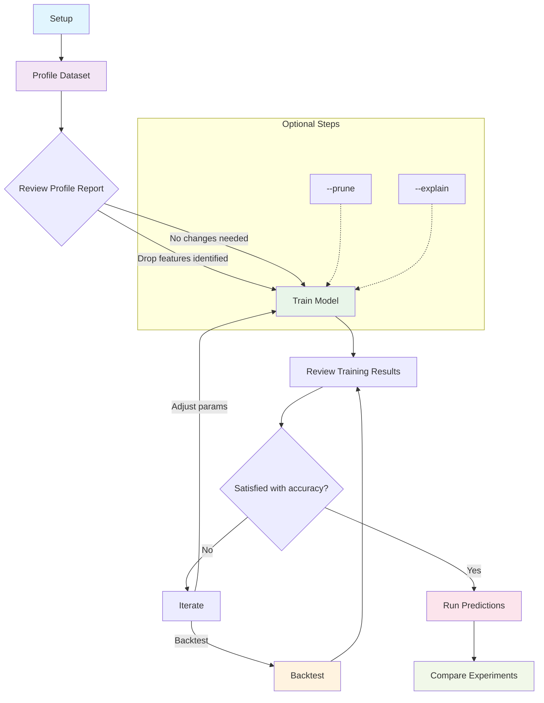
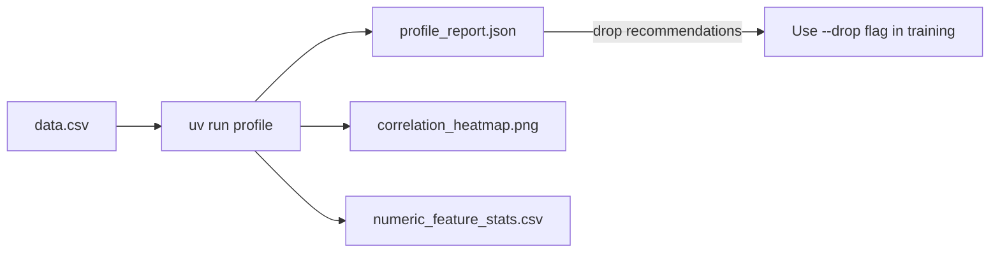
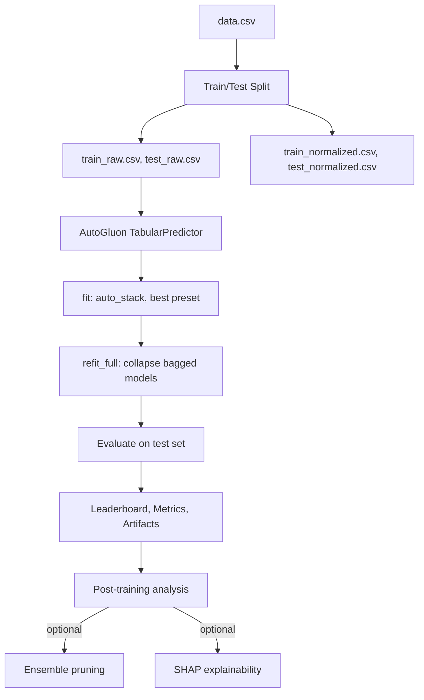
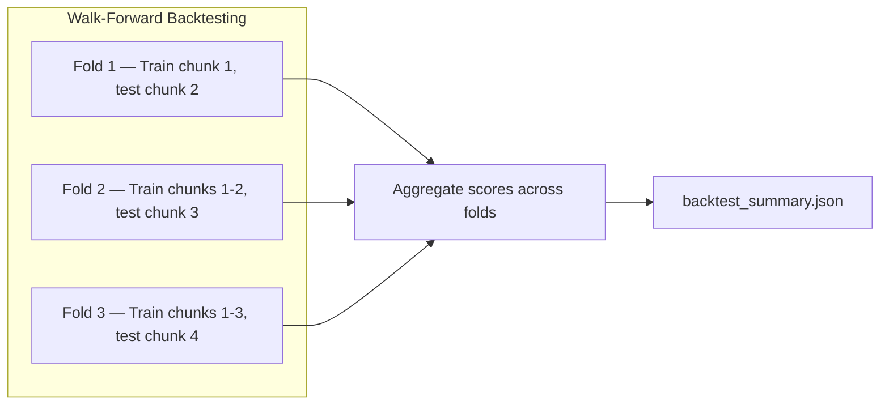
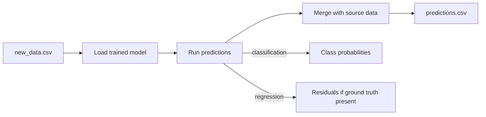
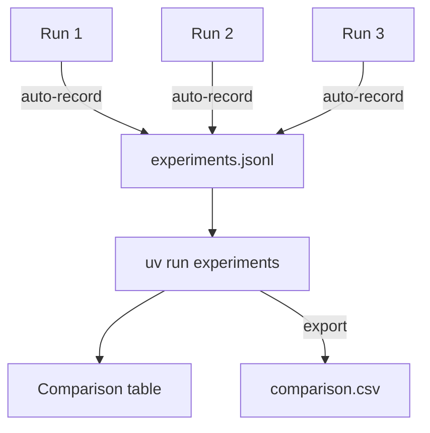

# Usage Guide

A step-by-step walkthrough of the full AutoML training pipeline — from raw CSV to production predictions.

## Process Flow



## Step 1: Setup

Install dependencies and verify the environment.

```bash
git clone <repo-url>
cd automl-model-training
uv sync
```

Verify Python version (requires >= 3.12):

```bash
uv run python --version
```

## Step 2: Profile Your Dataset

Before training, profile the dataset to understand its structure, quality, and feature relationships.

```bash
uv run profile data.csv --label target
```

This produces a timestamped directory (e.g., `output/profile_20260328_100000/`) containing:

| File | What to look for |
|------|-----------------|
| `profile_report.json` | Dataset overview, missing values, outlier flags, drop recommendations |
| `missing_values.csv` | Columns with high missing rates — consider dropping or imputing upstream |
| `numeric_feature_stats.csv` | Skew, kurtosis, outlier counts — identify problematic distributions |
| `categorical_feature_stats.csv` | High-cardinality columns that may need encoding decisions (only if categorical columns exist) |
| `correlation_matrix.csv` | Feature-feature and feature-label correlations |
| `correlation_heatmap.png` | Visual overview of correlation structure |



Review the recommendations:
- If highly correlated pairs are found, the report recommends which to drop
- The CLI prints a ready-to-use `--drop` flag you can paste into your train command
- Check for columns with >50% missing values — these rarely help model accuracy

## Step 3: Train the Model

Choose the appropriate training command based on your problem type.

**Binary classification:**
```bash
uv run train-binary data.csv --label is_fraud
```

**Regression:**
```bash
uv run train-regression data.csv --label price
```

**Auto-detect (or multiclass):**
```bash
uv run train data.csv --label target
```

**With profiling recommendations applied:**
```bash
uv run train-binary data.csv --label is_fraud --drop correlated_feat_1 correlated_feat_2
```

**With optional features:**
```bash
uv run train data.csv --label target --prune --explain
```

- `--prune` removes underperforming models from the ensemble after training
- `--explain` computes SHAP values for feature contribution analysis




Training produces a timestamped directory (e.g., `output/train_20260328_101500/`) with all artifacts.

## Step 4: Review Training Results

Check the key output files in the training run directory.

**Start with these files:**

1. `model_info.json` — confirms problem type, eval metric, best model name
2. `leaderboard_test.csv` — test-set scores for every model in the ensemble
3. `feature_importance.csv` — which features matter most (permutation-based)
4. `analysis.json` + `analysis_report.txt` — automated findings and recommendations

**For binary/multiclass, also check:**
- `confusion_matrix.csv` — where the model makes mistakes
- `classification_report.csv` — per-class precision, recall, F1
- `roc_auc.json` — ROC AUC score
- `test_predictions.csv` — actual vs predicted with class probabilities

**For regression, also check:**
- `residual_stats.json` — MAE, RMSE, R², residual distribution
- `test_predictions.csv` — actual, predicted, and residual per row

**If `--explain` was used:**
- `shap_summary.csv` — global feature importance ranked by mean |SHAP|
- `shap_per_row.json` — per-prediction top-5 feature contributions

**If `--prune` was used:**
- `pruning_report.json` — which models were removed and why

## Step 5: Iterate

If accuracy is not satisfactory, adjust and retrain. Common strategies:

| Issue | Action |
|-------|--------|
| Overfitting (val score >> test score) | Increase data, reduce features, try `--preset high_quality` |
| Low accuracy across the board | Add more features, increase `--time-limit`, check data quality |
| Class imbalance flagged | Use `--eval-metric f1_macro` or `balanced_accuracy` |
| Too many low-importance features | Use `--drop` with features from profiling recommendations |
| Ensemble too large / slow | Add `--prune` to remove underperforming models |

Each run creates a new timestamped directory, so previous results are preserved.

## Step 6: Backtest (Optional)

For time-series or temporal data, validate with walk-forward backtesting instead of random splits.

**Single cutoff:**
```bash
uv run backtest data.csv --date-column date --cutoff 2025-06-01 --label price
```

**Walk-forward with multiple folds:**
```bash
uv run backtest data.csv --date-column date --n-splits 3 --label churn
```



Each fold produces a full training run in its own subdirectory. The aggregate summary shows mean ± std of scores across folds.

## Step 7: Run Predictions

Once satisfied with model accuracy, run predictions on new data.

```bash
uv run predict new_data.csv --model-dir output/train_20260328_101500/AutogluonModels
```

The `--model-dir` must point to the `AutogluonModels/` directory inside a training run.



Prediction outputs go to `predictions_output/predict_<timestamp>/` by default.

**If the label column exists in the prediction CSV**, the pipeline automatically evaluates against it and includes scores in `prediction_summary.json`.

## Step 8: Compare Experiments

After multiple training runs, compare them side by side.

```bash
# View all experiments
uv run experiments

# Last 5 only
uv run experiments --last 5

# Export to CSV for external analysis
uv run experiments --output comparison.csv
```

The experiment log (`experiments.jsonl`) is automatically populated by every training run. Each entry records the full parameter set, metrics, and output path.



## Complete Workflow Example

Here's a full end-to-end example for a binary classification task:

```bash
# 1. Setup
uv sync

# 2. Profile the dataset
uv run profile fraud_data.csv --label is_fraud

# 3. Review profile — note recommended drops
#    (check output/profile_<timestamp>/profile_report.json)

# 4. Train with recommendations applied
uv run train-binary fraud_data.csv --label is_fraud \
    --drop correlated_col_1 low_variance_col_2 \
    --prune --explain

# 5. Review results
#    (check output/train_<timestamp>/ for all artifacts)

# 6. Backtest for temporal validation
uv run backtest fraud_data.csv --date-column transaction_date \
    --n-splits 3 --label is_fraud

# 7. Run predictions on new data
uv run predict new_transactions.csv \
    --model-dir output/train_<timestamp>/AutogluonModels

# 8. Compare all experiments
uv run experiments
```

## Verbosity Control

All commands support `--verbose` / `--quiet` flags:

```bash
uv run train data.csv --verbose    # DEBUG level — detailed output
uv run train data.csv              # INFO level — default
uv run train data.csv --quiet      # WARNING level — errors only
```
