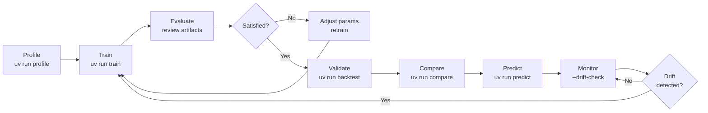
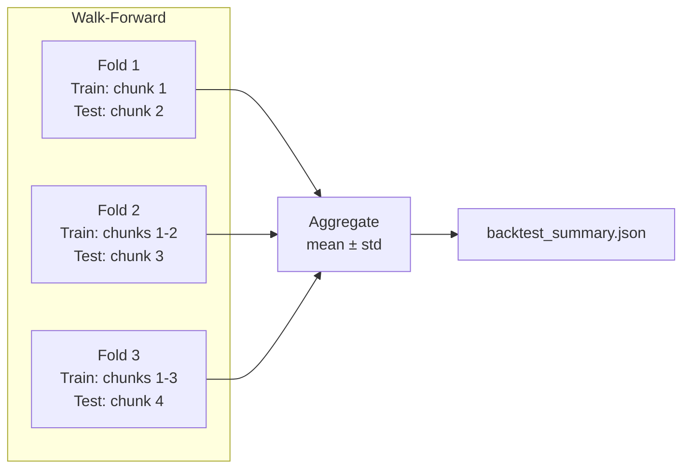
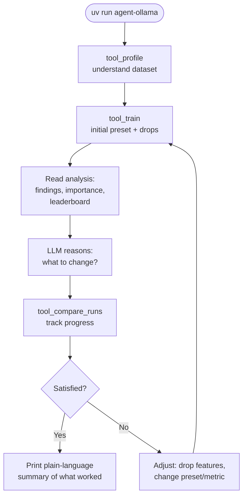

# Usage Guide

## Table of Contents

- [The Model Training Lifecycle](#the-model-training-lifecycle)
- [Step 1: Setup](#step-1-setup)
- [Step 2: Profile Your Dataset](#step-2-profile-your-dataset)
- [Step 3: Train the Model](#step-3-train-the-model)
- [Step 4: Review Training Results](#step-4-review-training-results)
- [Step 5: Iterate](#step-5-iterate)
- [Step 6: Validate with Backtesting](#step-6-validate-with-backtesting)
- [Step 7: Compare Runs](#step-7-compare-runs)
- [Step 8: Run Predictions](#step-8-run-predictions)
- [Complete Example](#complete-example)
- [Verbosity Control](#verbosity-control)
- [LLM-Driven Tool Workflow](#llm-driven-tool-workflow)
- [Automated Iteration with the Ollama Agent](#automated-iteration-with-the-ollama-agent)
  - [Setup (one-time)](#setup-one-time)
  - [Run](#run)
  - [What happens](#what-happens)
  - [Troubleshooting](#troubleshooting)

A step-by-step walkthrough of the full AutoML training pipeline — from raw CSV to production predictions.

## The Model Training Lifecycle

Every ML project follows the same cycle: understand the data, train a model, evaluate it, iterate until satisfied, deploy to production, and monitor for degradation. This pipeline automates each step.

```
Profile → Train → Evaluate → Iterate → Predict → Monitor
```



| Step     | Command                 | Why                                                |
| -------- | ----------------------- | -------------------------------------------------- |
| Profile  | `uv run profile`        | Understand data quality before training            |
| Train    | `uv run train`          | Build the best ensemble model                      |
| Evaluate | Review output artifacts | Check accuracy, overfitting, feature importance    |
| Iterate  | Adjust params, retrain  | Improve based on analysis recommendations          |
| Validate | `uv run backtest`       | Test on temporal data to simulate production       |
| Compare  | `uv run compare`        | Pick the best run from multiple experiments        |
| Predict  | `uv run predict`        | Run inference on new data                          |
| Monitor  | `--drift-check`         | Detect when production data diverges from training |

## Step 1: Setup

```bash
git clone <repo-url>
cd automl-model-training
uv sync
```

## Step 2: Profile Your Dataset

**Goal:** Identify data quality issues, redundant features, and class imbalance before spending time on training.

```bash
uv run profile data.csv --label target
```

Review the output:

- `profile_report.json` — drop recommendations, missing value flags, outlier counts
- `correlation_heatmap.png` — visual overview of feature relationships
- The CLI prints a `--drop` flag you can paste directly into your train command

## Step 3: Train the Model

**Goal:** Build the best ensemble model for your problem type.

```bash
# Auto-detect problem type
uv run train data.csv

# Or use convenience wrappers
uv run train-binary data.csv --label is_fraud
uv run train-regression data.csv --label price
```

**Integrated profiling** — skip the separate profile step:

```bash
uv run train data.csv --profile --label price
```

**Cross-validation** — get more reliable accuracy estimates:

```bash
uv run train data.csv --cv-folds 5
```

**Reproducibility** — verify results with different seeds:

```bash
uv run train data.csv --seed 42
uv run train data.csv --seed 123
```

**Full-featured run:**

```bash
uv run train data.csv --label target --profile --cv-folds 5 --prune --explain
```

## Step 4: Review Training Results

Check the key files in the timestamped output directory:

1. `model_info.json` — confirms problem type, eval metric, best model
2. `leaderboard_test.csv` — test-set scores for every model
3. `feature_importance.csv` — which features matter most
4. `analysis.json` — automated findings and actionable recommendations
5. `cv_summary.json` — cross-validation mean ± std (if `--cv-folds` was used)

The analysis report flags overfitting, class imbalance, low-value features, and dataset size issues — each with a specific recommendation.

## Step 5: Iterate

| Issue                            | Action                                                      |
| -------------------------------- | ----------------------------------------------------------- |
| Overfitting (val >> test score)  | Increase data, reduce features, try `--preset high_quality` |
| Low accuracy                     | Add features, increase `--time-limit`, check data quality   |
| Class imbalance flagged          | Use `--eval-metric f1_macro` or `balanced_accuracy`         |
| Too many low-importance features | Use `--drop` or `--profile` to auto-remove them             |
| Ensemble too large               | Add `--prune`                                               |
| Need more reliable estimates     | Add `--cv-folds 5`                                          |
| Binary F1/recall too low         | Add `--calibrate-threshold f1` to optimize the cutoff       |

Each run creates a new timestamped directory — previous results are preserved.

## Step 6: Validate with Backtesting

**Goal:** For time-dependent data, test how the model performs on future data rather than random splits.

```bash
# Single cutoff
uv run backtest data.csv --date-column date --cutoff 2025-06-01 --label price

# Walk-forward with 3 folds
uv run backtest data.csv --date-column date --n-splits 3 --label churn
```



## Step 7: Compare Runs

**Goal:** After multiple experiments, pick the best one objectively.

```bash
# Compare two runs side by side
uv run compare output/train_20260321_120530 output/train_20260322_090000

# Or use the experiment log
uv run experiments --last 5
```

The `compare` command shows test scores, model families, feature counts, training times, and CV results in a single table.

## Step 8: Run Predictions

**Goal:** Apply the trained model to new data.

```bash
uv run predict new_data.csv --model-dir output/train_<ts>/AutogluonModels
```

**Flag uncertain predictions** for human review:

```bash
uv run predict new_data.csv --model-dir output/train_<ts>/AutogluonModels --min-confidence 0.7
```

**Check for data drift** against the training distribution:

```bash
uv run predict new_data.csv \
  --model-dir output/train_<ts>/AutogluonModels \
  --drift-check output/train_<ts>
```

Drift detection uses Population Stability Index (PSI) to flag features whose distributions have shifted since training. Significant drift (PSI > 0.25) means the model may be unreliable on this data.

## Complete Example

```bash
# 1. Setup
uv sync

# 2. Profile + train with CV, pruning, and explainability
uv run train-binary fraud_data.csv --label is_fraud \
    --profile --cv-folds 5 --prune --explain

# 3. Review results
cat output/train_<ts>/analysis_report.txt
cat output/train_<ts>/cv_summary.json

# 4. Backtest for temporal validation
uv run backtest fraud_data.csv --date-column date --n-splits 3 --label is_fraud

# 5. Compare all runs
uv run compare output/train_<ts1> output/train_<ts2>

# 6. Predict on new data with drift check and confidence filtering
uv run predict new_transactions.csv \
    --model-dir output/train_<ts>/AutogluonModels \
    --drift-check output/train_<ts> \
    --min-confidence 0.7

# 7. Review experiment history
uv run experiments
```

## Verbosity Control

All commands support `--verbose` / `--quiet`:

```bash
uv run train data.csv --verbose    # DEBUG level
uv run train data.csv              # INFO level (default)
uv run train data.csv --quiet      # WARNING level
```

## LLM-Driven Tool Workflow

The project exposes a JSON-serializable tool layer (`automl_model_training.tools`) that any LLM agent framework can call — Bedrock Agents, LangChain, OpenAI function calling, or the bundled Ollama agent. Use these tools when you want an LLM to reason about your data and drive iteration, or when you want to invoke individual capabilities from a notebook.

### The complete tool lifecycle

```
tool_profile               →  Understand shape, distributions, missing values
tool_deep_profile          →  Per-feature recommendations for engineering
tool_detect_leakage        →  Catch features that cheat (before training)
tool_engineer_features     →  Create log/ratio/bin/onehot features
tool_train                 →  Fit the ensemble, get scores + findings
tool_inspect_errors        →  See actual failure modes
tool_shap_interactions     →  Find redundant/coupled features (needs --explain)
tool_partial_dependence    →  See HOW each feature affects predictions
tool_partial_dependence_2way → 2D response surface for a feature pair (additive/synergy/saddle/threshold)
tool_tune_model            →  HPO on a single family when one dominates
tool_optuna_tune           →  Optuna TPE HPO with pruning + study persistence across sessions
tool_calibration_curve     →  Binary: reliability diagram, ECE, miscalibration direction
tool_threshold_sweep       →  Binary: precision/recall/F1/MCC curves across the threshold space
tool_compare_importance    →  Diff feature importance across two runs (leakage detector)
tool_model_subset_evaluate →  Per-model leaderboard; find a cheaper single model near the best
tool_compare_runs          →  Track progress across iterations
tool_predict               →  Inference on new data
```

### When to call each tool

| Scenario                                               | Tool                       |
| ------------------------------------------------------ | -------------------------- |
| First look at any dataset                              | `tool_profile`             |
| Planning to engineer features                          | `tool_deep_profile`        |
| Before the first training run                          | `tool_detect_leakage`      |
| Profile shows skewed features or date columns          | `tool_engineer_features`   |
| Training score plateaus — need to see what's failing   | `tool_inspect_errors`      |
| One model family dominates, want to squeeze more       | `tool_tune_model` / `tool_optuna_tune` |
| Have SHAP values, wonder if features are redundant     | `tool_shap_interactions`   |
| SHAP says feature is important but want to know HOW    | `tool_partial_dependence`  |
| SHAP interaction flagged a pair — what is the shape?   | `tool_partial_dependence_2way` |
| Binary: should I trust the model's probabilities?      | `tool_calibration_curve`   |
| Binary: what is the best decision threshold, and why?  | `tool_threshold_sweep`     |
| After feature engineering — did importance shift in a suspicious way? | `tool_compare_importance` |
| Before deployment — is the ensemble worth its cost?    | `tool_model_subset_evaluate` |
| Tracking improvement across attempts                   | `tool_compare_runs`        |

### Example: manual LLM-style loop in a notebook

```python
from automl_model_training.tools import (
    tool_profile, tool_deep_profile, tool_detect_leakage,
    tool_engineer_features, tool_train, tool_inspect_errors,
)

# 1. Understand the data
profile = tool_profile("data.csv", label="target")

# 2. Pre-training safety check
leaks = tool_detect_leakage("data.csv", label="target")
drop_list = [s["feature"] for s in leaks["suspected_leaks"]]

# 3. Get engineering recommendations
deep = tool_deep_profile("data.csv", label="target")

# 4. Apply suggested transforms
if deep["suggested_transforms"]:
    engineered = tool_engineer_features(
        "data.csv", deep["suggested_transforms"], label="target"
    )
    train_csv = engineered["engineered_csv"]
else:
    train_csv = "data.csv"

# 5. Train
result = tool_train(train_csv, label="target", drop=drop_list, explain=True)

# 6. Inspect failures
errors = tool_inspect_errors(result["run_dir"], n=20)
```

### Requirements for advanced tools

- `tool_shap_interactions` and per-row SHAP analysis require `tool_train(..., explain=True)` first
- `tool_partial_dependence` and `tool_partial_dependence_2way` require an existing `AutogluonModels/` directory; they load the trained predictor. The 2-way variant is cost-capped at 50k prediction rows by default — reduce `n_values_a`/`n_values_b` or `sample_size` if it refuses the call
- `tool_threshold_sweep` and `tool_calibration_curve` are **binary-only** and read `test_predictions.csv` (written by every binary run) — no re-inference, returns in milliseconds
- `tool_compare_importance` diffs two runs' `feature_importance.csv`; a new feature that tops importance with a flat score delta is almost always leakage
- `tool_model_subset_evaluate` reads `leaderboard_test.csv` only — no re-inference, returns in milliseconds
- `tool_tune_model` does a full AutoGluon fit with its built-in HPO — expect it to take minutes, not seconds
- `tool_optuna_tune` runs a single concrete AutoGluon fit per trial; total wall-clock ≈ `n_trials × time_limit_per_trial` minus pruning savings. The Ollama agent auto-injects a persistent sqlite study so repeated calls resume prior learning
- `tool_detect_leakage` uses sklearn depth-3 trees with 3-fold CV — runs in seconds on any dataset

## Automated Iteration with the Ollama Agent

**Goal:** Skip manual iteration entirely and let a local LLM drive the full train → analyze → adjust → retrain loop.

**Why use this instead of `agent-binary` / `agent-regression`:** The hardcoded agents follow fixed rules. The Ollama agent reads the full `analysis.json` output and reasons about it — it can handle any problem type, respond to nuanced findings, and explain its decisions in plain language.

### Setup (one-time)

```bash
brew install ollama
ollama pull qwen2.5:14b   # best tool-calling reliability
ollama serve               # starts API on http://localhost:11434
uv sync                    # installs the openai dependency
```

### Run

```bash
# Let the LLM iterate up to 5 times and find the best model
uv run agent-ollama data.csv --label target

# Regression problem
uv run agent-ollama data.csv --label price --max-iterations 8

# Faster model for quick experiments
uv run agent-ollama data.csv --label churn --model llama3.1:8b
```

### What happens

1. The LLM calls `tool_profile` to understand the dataset
2. It calls `tool_train` with an initial preset and drop list
3. It reads the returned `analysis`, `leaderboard`, `low_importance_features`, and `negative_importance_features`
4. It decides what to change: drop bad features, escalate the preset, switch eval metric for imbalanced data, add cross-validation for small datasets
5. It calls `tool_compare_runs` to track progress
6. When satisfied, it stops and prints a plain-language summary of what worked and why



### Troubleshooting

- **Connection refused** → run `ollama serve` first
- **Model not found** → run `ollama pull qwen2.5:14b`
- **Agent loops without progress** → switch to `qwen2.5:14b`; smaller models malform tool calls
- **Verbose output** → add `--verbose` to see each tool call and result
